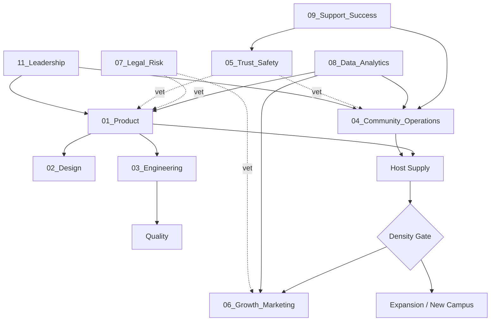

# Dependency Map — Who Blocks Whom

Squad's work is a mix of sequential dependencies (A must finish before B starts) and parallel work (C and D proceed together). This file is the contract between departments.

---

## Sequential Dependencies (Hard Blocks)
| # | Blocker | Must Finish Before | Notes |
|---|---|---|---|
| 1 | Legal + T&S approve a new activity type or safety feature | Any launch or promotion of it | Veto power; see Escalation_Matrix |
| 2 | Engineering ships host verification + event tools | Community scales host recruitment | Community can recruit pilot hosts in parallel, but cannot *verify* until tooling exists |
| 3 | Product + Design finalize a flow | Engineering builds it | Changes after handoff raise a Change Request ticket |
| 4 | Density gate met in campus N (attendance >70%, 30 anchor events) | Growth spends on acquisition for campus N+1 | Growth waits; organic/referral only before the gate |
| 5 | Data instruments a metric | Any experiment claims that metric | Prevents "we think it worked" decisions |
| 6 | T&S builds reporting + investigation workflow | Community opens any new campus | Safety rails precede real-world scale |

## Parallel Work (Proceed Simultaneously)
- While Engineering builds check-in, Community recruits pilot hosts and partners with existing clubs.
- While Design prototypes an indoor-event flow, T&S drafts the facilitation norms and Data prepares the measurement plan.
- While Product specs a feature, Legal reviews liability exposure and Support drafts help-center content.

## Data Dependencies (Who Needs Whose Numbers)
| Consumer | Needs From | Metric |
|---|---|---|
| Product | Data/Analytics | Attendance rate, repeat rate, funnel drop-off |
| Community | Data/Analytics | Host activation, event health, no-show rate |
| Growth | Data/Analytics | Density per campus, referral conversion, churn |
| T&S | Data/Analytics | Report volume, resolution times, repeat-offender signals |
| Leadership | All departments | Weekly status reports (Templates) |

## The Founder's Golden Rule
> When two things can be done in parallel, never serialize them. When there is a hard block, never pretend it isn't there. This map is checked in every Leadership Meeting.
